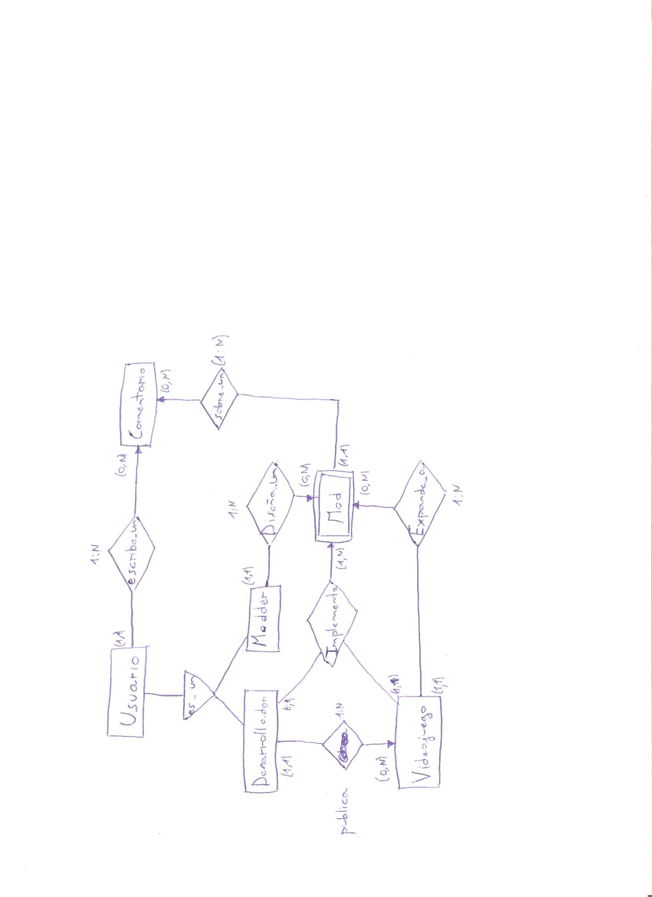

# GameSquare

Web dedicada a la facilitación del desarrollo de videojuegos y la creación de contenido adicional para estos.
En ella participan tanto los desarrolladores de los videojuegos originales, como los creadores de contenido adicional/mods, conocidos como modders.

+ Funcionalidad pública: Buscar videojuegos y mods para descargar
+ Funcionalidad privada: Publicar un videojuego, subir un mod, comentar sobre un mod, implementar el contenido de un mod sobre el juego base.

Base de datos relacional

# Integrantes

Alejandro	Hernández Pérez -> a.hernandezp.2016@alumnos.urjc.es
Mario	Márquez Balduque -> m.marquezb.2016@alumnos.urc.es
Javier Bravo Bolívar ->	j.bravo.2016@alumnos.urjc.es
