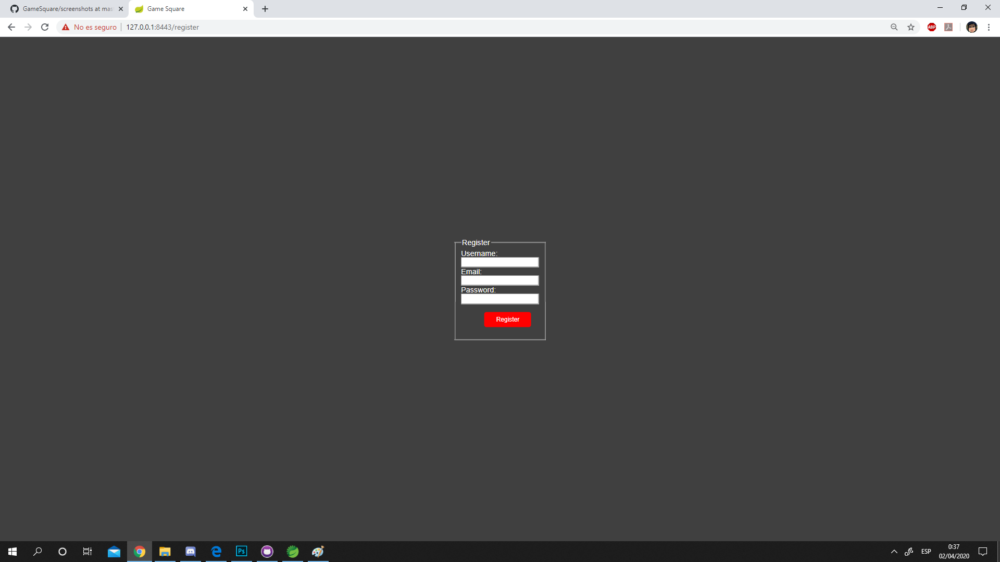

# GameSquare

Web dedicada a la facilitación del desarrollo de videojuegos y la creación de contenido adicional para estos.
En ella participan tanto los desarrolladores de los videojuegos originales, como los creadores de contenido adicional/mods, conocidos como modders.

+ Funcionalidad pública: Buscar videojuegos y mods para descargar
+ Funcionalidad privada: Publicar un videojuego, subir un mod, comentar sobre un mod/videojuego
+ Servicio interno: Notificar al desarrollador con un correo cuando se publique un mod de su juego, notificar a los usuarios a través de un correo cuando se publique un juego nuevo.

## Entidades principales

+ Usuario: Posee nombre de usuario, correo, contraseña, fecha de registro y número de comentarios. Puede ser a su vez un desarrollador y/o modder. Entidad básica que interactúa con la página, puede escribir comentarios y descargar juegos y mods.
  + Desarrollador: Es una extensión del usuario, que tiene la opción de publicar juegos. Posee, por tanto, los juegos que tiene publicados. 
  + Modder: Igual que la entidad anterior, pero en lugar de juegos posee mods publicados.
+ Software: Posee nombre, fecha de publicación, género, descripción, autor/es, desarrollador y lista de comentarios.
  + Videojuego: extiende sofware.
  + Mod: extiende software, posee el nombre del videojuego al que pertenece.
+ Comentario : Posee autor, cuerpo, fecha de publicación y nombre de videojuego/mod al que pertenece.

## Base de datos relacional

## Esquema de plantillas de la web

## Capturas de las patallas de la web

Pantalla de inicio. Permite rigistrarse o logearse, hacer una búsqueda, consultar los últimos juegos y mods además de acceder a la lista completa de cada uno de ellos

Pantalla de login. Permite acceder a una cuenta que esté en la base de datos

Pantalla de registro. Permite crear una nueva cuenta en la base de datos

Pantalla de perfil personal. Permite consultar los datos del perfil, acceder a la pantalla de modificación de perfil y publicar tanto juegos como mods y acceder a ellos

Pantalla de modificación de datos del perfil. Permite modificar informoación personal del perfil

Pantalla de búsqueda. Muestra los resultados introducidos en la barra de búsqueda

Pantalla de datos y comentarios de un mod. Muestra todos los datos relacionados con el mod en cuestión y hacer comentarios si el usuario está logeado en la página.

Pantalla de datos, mods y comentarios de un juego. Muestra todos los datos relacionados con el mod en cuestión junto con una lista con sus mods y hacer comentarios si el usuario está logeado en la página.

## Clases y templates

El controlador SessionControler utiliza las templates "session" y "template".
El controlador AppControler utiliza las templates "index", "modify_profile", "template", "profile", "publish", "games", "mods", "mods_list", "games_list", "search_list".

## Despliegue en máquina virtual
1. Instalamos vagrant y virtual box en el equipo
2. Creamos un directorio en el cual vayamos a querer que se almacene la máquina, con el terminal abierto sobre esa ruta ejecutamos «vagrant init ubuntu/trusty32» generándose un fichero vagrantfile en el cual debemos descomentar la línea «config.vm.network "private_network", ip: "192.168.33.10"» para así poder comunicar la mv y nuestra máquina física por medio de la ip 192.168.33.10
3. En el mismo directorio que antes ejecutamos «vagrant up», si no tenemos descargados los datos de la máquina ubuntu de tipo trusty32 se descargará y se arrancará una nueva mv, si ya teniamos los datos solamente se arrancará una nueva mv.
4. Una vez arrancada la máquina debemos ejecutar «vagrant ssh» para poder acceder a la línea de comandos de la máquina, cuando estemos dentro de ella ejecutaremos «Sudo apt-get update» para actualizar las versiones de los paquetes disponibles para descargar, posteriormente descargamos tanto el jre de java 7 como el driver de servidor de mysql («Sudo apt-get install -y openjdk-7-jre» y «sudo apt-get install -y mysql-server»)
5. Una vez que la máquina tenga java 7 y mysql tenemos que crear la base de datos que utilizará la aplicación, para ello entramos en la configuración de mysql del usuario root con «mysql -u root -p», después nos pedirá que escribamos la contraseña. Una vez dentro crearemos la base de datos con el mismo nombre que tenga en nuestra aplicacion en el apartado properties, en nuestro caso gamesquaredb, para ello hacemos uso del siguiente comando «CREATE DATABASE gamesquaredb;». Cuando ya esté creada la bd no cerraremos la sesión de mysql, si no que abriremos otra terminal para ejecutar tanto la aplicación como el servicio interno.
6. Compilamos los proyectos dentro del sts para generar los jars que se ejecutarán dentro de la mv (ojo, en versión java 7) una vez compilados introducimos ambos jars en la carpeta compartida por ambas máquinas (la misma en la que se encuentra el fichero vagrantfile), accedemos a la mv con dos terminales con «vagrant ssh» y dentro de cada una cambiamos de directorio a la carpeta vagrant (cd /vagrant) y posteriormente ejecutamos ambos jars (cada uno en una terminal distinta) con «java -jar <nombredelfichero.jar>»
7. Después de todo esto, accedemos por medio de un navegador en nuestra máquina física a https://192.168.33.10:8443 y listo.

## Integrantes

+ Alejandro	Hernández Pérez -> a.hernandezp.2016@alumnos.urjc.es , Darkc0m
+ Mario	Márquez Balduque -> m.marquezb.2016@alumnos.urjc.es , Rinkashiki
+ Javier Bravo Bolívar ->	j.bravo.2016@alumnos.urjc.es , javierb1984
